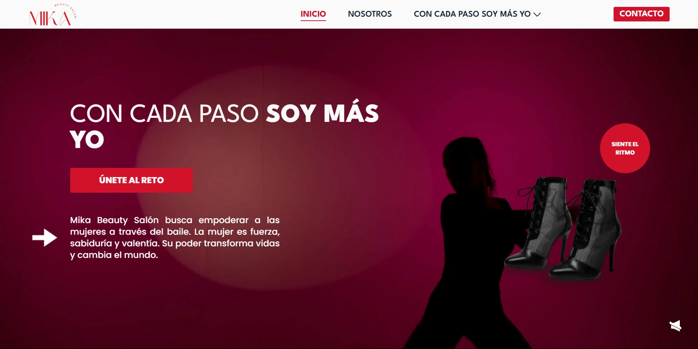

# 💃 Mika - Beauty Salon

Official website for the women's empowerment campaign organized by _Mika Beauty Salon_.  
The project aims to inspire women through _Heels Dance_ (also known as _Strip Dance_), promoting self-esteem, sensuality, and personal power.

🌐 **Live site:** [https://mika-beauty-salon.jexugaz.work](https://mika-beauty-salon.jexugaz.work)

## 🎯 Purpose of the Website

This site was created as part of a campaign to empower women.  
The initiative is led by _Mika Beauty Salon_, offering a safe and motivating space where each woman can reconnect with her strength and sensuality.

---

## 📸 Preview



---

## 🧾 Features

- ✨ Beautiful and responsive design
- 🎥 Short-form video sections with custom controls (like reels)
- 🧴 Dedicated sections for:
  - Learning about the campaign
  - Testimonials
  - Mini-documentary
  - Direct contact
- 📋 Contact form
- 📱 Mobile-friendly
- 🚀 Performance-optimized using Astro

---

## 📁 Project Structure

```
src/
├── assets/ # Images and static assets
├── components/ # Shared and client-side components
├── layouts/ # Base layout
├── pages/ # Site routes
├── styles/ # Global styles
├── types/ # Custom TypeScript types
└── utils/ # Hooks and utilities
```

---

## ⚙️ Local Setup and Development

1. **Clone the repository:**

```bash
git clone https://github.com/JexUgaz/mika-beauty-salon.git
cd mika-beauty-salon
```

2. **Install dependencies:**

```bash
npm install
```

3. **Start the development server:**

```bash
npm run dev
```

## 📦 Build for Production

```bash
npm run build
```

The final output will be in the /dist folder.

## 🧪 Tech Stack

- [Astro](https://astro.build/)
- [React](https://reactjs.org/) (for interactive components)
- [TypeScript](https://www.typescriptlang.org/)
- [Tailwind CSS](https://tailwindcss.com/)
- [GitHub Actions](https://github.com/features/actions) for deployment
